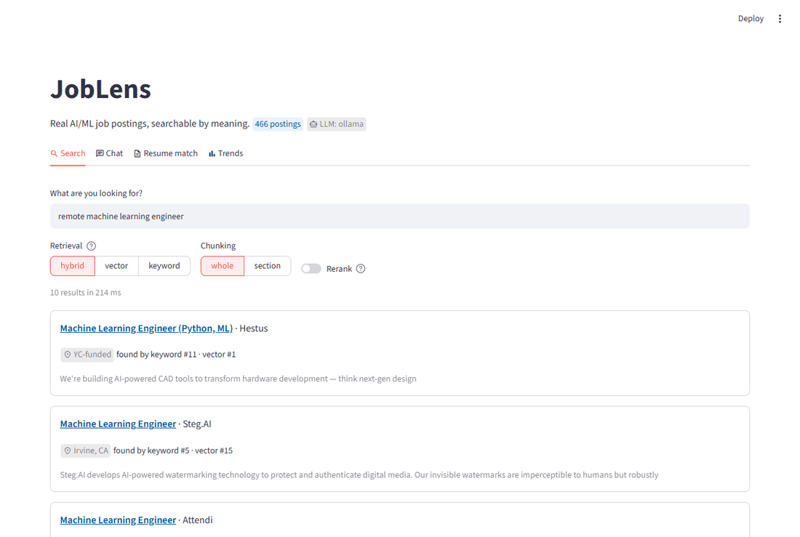
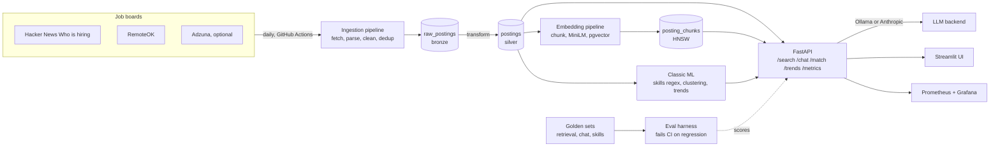
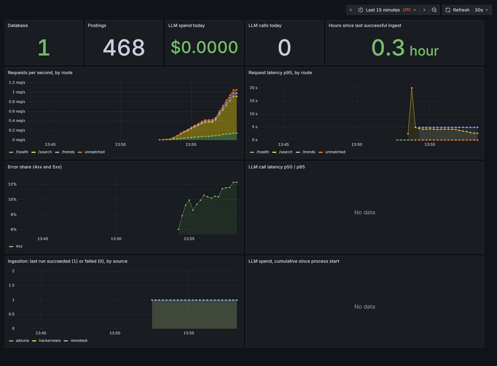

# JobLens

[](https://github.com/raviteja311/JobLens-AI-Job-Market-Assistant/actions/workflows/ci.yml)
[](https://github.com/raviteja311/JobLens-AI-Job-Market-Assistant/actions/workflows/deploy.yml)
[](https://github.com/raviteja311/JobLens-AI-Job-Market-Assistant/actions/workflows/ingest.yml)

**Real AI/ML job postings, collected daily, searchable by meaning, matched
against your resume, and answerable with citations.** Every claim on this page
has a number next to it, and the numbers that did not go the way the plan
said are here too.



*Recorded from the running UI by `python scripts/demo_gif.py`. Search and
Trends only: chat and resume matching take about 50 seconds an answer on the
local model.*

**Live URL:** not deployed yet. The API image is published at
`ghcr.io/raviteja311/joblens`, the pipeline that builds it is green, and the
deploy step is waiting on a hosting account. See Phase 7. Until then, three
commands run the whole thing:

```bash
cp .env.example .env
docker compose up --build         # Postgres, API on :8000, UI on :8501
open http://localhost:8501
```

## Architecture



## Results

Two tables carry the project. Both are reproduced with `make eval` and
`make distil-eval`; the full write-ups, including the runs that failed, are
in [docs/experiments.md](docs/experiments.md).

**Retrieval**, 15 judged queries over 465 postings. Hybrid lost to plain
vector search, which was not the expected result; reranking was the real
gain.

| configuration | recall@5 | recall@10 | MRR | nDCG@10 | ms/query |
| --- | ---: | ---: | ---: | ---: | ---: |
| keyword | 0.299 | 0.358 | 0.406 | 0.328 | 25 |
| vector (whole) | 0.569 | 0.692 | 0.773 | 0.598 | 34 |
| vector (section) | 0.491 | 0.813 | 0.734 | 0.684 | 35 |
| hybrid (whole) | 0.438 | 0.666 | 0.761 | 0.620 | 94 |
| hybrid + rerank | 0.497 | 0.725 | **0.900** | **0.692** | 3145 |

**Skill extraction**, 60 blind-judged postings with 138 gold mentions. The
fine-tuned student recovered from a 0.000 collapse to 0.485, and the 80-line
regex it was meant to replace still ships.

| extractor | micro F1 | precision | recall | ms/call |
| --- | ---: | ---: | ---: | ---: |
| rules (Phase 2 regex) | **0.663** | **0.986** | 0.500 | **5** |
| teacher (llama3.1 8B) | 0.634 | 0.551 | **0.746** | 9,512 |
| tuned-v2 (Qwen 0.5B + LoRA) | 0.485 | 0.516 | 0.457 | 4,201 |
| base (Qwen 0.5B) | 0.104 | 0.094 | 0.116 | 6,046 |
| tuned-v1 (collapsed) | 0.000 | 0.000 | 0.000 | 3,105 |

**Chat**, 8 questions of which half are unanswerable from the corpus:
refusal accuracy 1.00 (gated in CI, floor 0.75), citation rate 0.75, judge
scores uncalibrated and labelled as such.

## Status

Phases 0 to 7 of the [12-week plan](docs/devlog.md) are complete, Phase 7
locally. 468 postings from 2 live sources, hybrid search over pgvector,
grounded chat and resume matching on a local LLM, an eval suite that fails
CI on a regression, a distillation experiment whose headline is that a regex
won, and a containerised, monitored stack with a runbook. Phase 8 is this
page, the [three blog drafts](docs/blog/) and the
[resume bullets](docs/resume-bullets.md).

## Development process

Every phase ends with three things: a merged PR, an updated section in
this README, and a note in `docs/devlog.md`. Experiments, including the ones
that failed, go in `docs/experiments.md`.

## Setup

Requires Python 3.12 and Docker. The LLM features need either Ollama running
locally or an Anthropic key; everything else runs without both.

```bash
python -m venv .venv
source .venv/bin/activate
pip install -e ".[dev]"
pre-commit install

cp .env.example .env
docker compose up -d db
python -m joblens migrate
python -m joblens ingest
python -m joblens embed --strategy whole --strategy section
```

Then `make serve` for the API and `make ui` for the dashboard.

Or skip the virtualenv and run the whole stack in containers:

```bash
cp .env.example .env
docker compose up --build                    # Postgres, API on :8000, UI on :8501
docker compose --profile monitoring up -d    # plus Prometheus :9090 and Grafana :3000
```

## Commands

Everything runs through one entry point, so the cron job, CI and a human
debugging a bad run all take the same code path.

```bash
python -m joblens ingest --limit 200   # fetch every source into the database
python -m joblens transform            # re-parse bronze after a parser fix
python -m joblens stats                # what is in the database right now
python -m joblens embed                # build the vector index
python -m joblens search "remote LLM role" --rerank
python -m joblens chat "who is hiring Rust engineers?"
python -m joblens match resume.pdf     # rank jobs against a resume
python -m joblens eval --suite all     # the scorecard
python -m joblens spend                # what the LLM calls have cost
python -m joblens serve                # the API
```

## Repo structure

```
src/joblens/         ingestion pipeline, sources, database
src/joblens/ml/      Phase 2: skills, salary model, clustering, trends
src/joblens/search/  Phase 3: chunking, embeddings, retrieval, reranking
src/joblens/llm/     Phase 4: LLM backends, versioned prompts, call logging
src/joblens/rag/     Phase 4: grounded chat, resume matching
src/joblens/api/     Phase 4: FastAPI backend
src/joblens/eval/    Phase 3+5: golden set, metrics, judge, regression gate
src/joblens/finetune/ Phase 6: teacher labels, LoRA training, extractor benchmark
src/joblens/observability.py  Phase 7: JSON logs, Prometheus metrics
prompts/             versioned prompt files, one directory per prompt
data/golden/         the judged queries everything is scored against
tests/               pytest suite
migrations/          schema, applied by `joblens migrate`
monitoring/          Phase 7: Prometheus scrape config, Grafana dashboard and alerts
docs/                devlog, experiments, runbook, blog drafts, resume bullets
scripts/demo_gif.py  records the README demo from the running UI
Dockerfile           one image for the API and the UI
```

## Phases

### Phase 0: Setup and habits

Repo structure, pyproject.toml, pre-commit with ruff and black, project
board with phases as milestones.

### Phase 1: Data ingestion pipeline

Three source adapters behind one interface. A source is any module with
`fetch(limit)` and `to_posting(payload)`, which is what lets the pipeline
re-parse everything already collected after a parser fix without touching the
network.

| source | postings | API key | notes |
| --- | ---: | --- | --- |
| Hacker News "Who is hiring" | 366 | none | free-text comments, no schema at all |
| RemoteOK | 99 | none | structured, entirely remote |
| Adzuna | 0 | required | registered but skipped without a key |

**Storage** is bronze/silver. `raw_postings` keeps the payload exactly as the
source sent it, one row per fetch, history retained. `postings` holds our
interpretation. When the salary parser turns out to be wrong, `transform`
re-runs over the raw layer instead of waiting two weeks to re-collect.

**Cleaning** strips HTML with the stdlib, normalises locations against a
lookup table rather than a geocoder, and parses salary out of free text:
ranges, `up to`, `from`, hourly and monthly rates, six currencies, and the
strings that mean "we are not telling you". Hourly and monthly figures are
annualised only when the period was actually stated; a guessed period is how a
$60/hr contract ends up in the data as a $60 salary.

**Dedup** is an exact match on a normalised content hash of title, company and
location, with seniority words removed. It finds 26 duplicates. Phase 3 adds a
second, different signal rather than replacing it.

**Reliability.** Retries with backoff on 429 and 5xx, fails fast on other 4xx.
One source failing does not stop the others. Every run writes to
`ingestion_runs` with counts and any error. 34 of 400 Hacker News comments are
replies rather than postings and are counted as skipped, not dropped silently.

**Schedule.** `.github/workflows/ingest.yml` runs daily at 06:00 UTC and is
idempotent, so a missed slot costs that day's postings and nothing else.

### Phase 2: Classic ML layer

Everything here runs on the Phase 1 corpus. No LLM calls, no embeddings. These
are the baselines Phases 3 and 6 have to beat, so they stay in the repo
permanently. Full write-ups in `docs/experiments.md`.

**Skill extraction.** An alias table over 80 canonical skills with
case-insensitive regex, plus a TF-IDF keyword extractor for the terms the
table does not know about yet. Coverage, the share of postings where at least
one known skill is found, is **58.9%**.

| skill | postings | share |
| --- | ---: | ---: |
| python | 112 | 24.1% |
| typescript | 83 | 17.8% |
| postgresql | 71 | 15.3% |
| llm | 59 | 12.7% |
| aws | 51 | 11.0% |
| kubernetes | 48 | 10.3% |

**Salary regression: the baseline won.** 106 postings with a salary that
parsed, 5-fold CV, MAE as the headline because a few 750k postings dominate
RMSE.

| model | MAE (USD) | RMSE (USD) | R2 | vs median |
| --- | ---: | ---: | ---: | ---: |
| ridge | 62,904 | 88,374 | -0.098 | +1.8% |
| ridge_log | 63,119 | 88,790 | -0.064 | +1.4% |
| median | 64,042 | 86,859 | -0.036 | +0.0% |
| random_forest | 68,563 | 97,385 | -0.340 | -7.1% |
| gradient_boosting | 78,292 | 113,514 | -1.113 | -22.3% |

The ridge's 1.8% edge is inside the noise, and its top features are `money`,
`worth` and `meaningful`, which is what 106 rows against 14,000 TF-IDF columns
looks like. Seven more configurations were tried; all converge towards the
baseline rather than past it. **There is no salary prediction endpoint** and
there will not be one until there are roughly 500 salary-disclosing postings.

**Clustering.** TF-IDF and k-means, k chosen by silhouette, clusters labelled
from their own centroid terms. k=10 gives nameable families: `founding
engineer`, `forward deployed engineer`, `open source / developer`, `ml / ai`,
`san francisco onsite`, `rails / toronto`.

The first version produced a 99-posting cluster defined by the terms
`applicants`, `rmjcuni4xmjgumja5`, `read`, `word`, `human`. RemoteOK appends
an anti-bot canary to every posting it serves, containing a token that is
base64 of the scraper's own IP, which made it the most discriminative term in
the corpus. `cleaning.strip_noise()` removes it and the URLs that had built a
second cluster meaning "uses Ashby". Stripping it made the clusters obviously
better and the silhouette score slightly **worse**, which is the argument for
building the golden dataset before trusting any unsupervised metric.

**Trends.** Top skills over time, demand by region, remote share, median
advertised salary by skill. Every share is reported against the postings that
could have answered the question: 65% are remote, but only 23% state a salary.

### Phase 3: Embeddings and semantic search

pgvector, a local MiniLM, hybrid retrieval, a cross-encoder reranker, and the
golden set that makes all of it measurable.

**The golden set** is 60 real queries in `data/golden/retrieval.yaml`, of
which 15 are judged, graded 0 (no) / 1 (acceptable) / 2 (exactly what was
asked). Judgements key on `(source, source_id)` and never on the primary key,
because a re-ingest into an empty database renumbers every posting and would
silently re-point every judgement at a different job. Candidates come from a
pool of all three retrievers, not from the system under test, so a retriever
cannot score well against its own blind spots.

**Retrieval comparison**, 15 judged queries, 465 postings, models warmed
before timing:

| configuration | recall@5 | recall@10 | mrr | ndcg@10 | ms/query |
| --- | ---: | ---: | ---: | ---: | ---: |
| keyword | 0.299 | 0.358 | 0.406 | 0.328 | 25 |
| vector (whole) | 0.569 | 0.692 | 0.773 | 0.598 | 34 |
| vector (section) | 0.491 | 0.813 | 0.734 | 0.684 | 35 |
| hybrid (whole) | 0.438 | 0.666 | 0.761 | 0.620 | 94 |
| hybrid (section) | 0.430 | 0.646 | 0.736 | 0.600 | 93 |
| hybrid + rerank | 0.497 | 0.725 | **0.900** | **0.692** | 3145 |

**Hybrid lost to plain vector search**, which was not the expected result.
Keyword retrieval has to OR its terms, because ANDing them (what
`websearch_to_tsquery` does) returns nothing at all for "remote machine
learning engineer working on LLMs"; the first version of this shipped that
way and the keyword arm contributed zero candidates. With OR it contributes,
but for a six-word query it ranks a posting matching only "engineer" first,
and reciprocal rank fusion hands that rank-1 noise the same weight as the
vector arm's best result.

Hybrid stays the default anyway, for the case the averages cannot show. On the
query `pgvector`, vector search returns Marketing Manager and ON SITE TORONTO,
because an embedding of "pgvector" is mostly "database"; keyword search
returns the one posting that names it, at rank 1. Hybrid is insurance against
the query type embeddings cannot handle, bought at a measurable cost on
ordinary queries. That is the honest summary and it is in the limitations.

**Reranking is the real improvement.** MRR 0.773 to 0.900, at 3.1 seconds a
query on CPU, so it is off by default and on behind `--rerank`.

**Chunking.** Whole-posting vectors win at the top of the ranking (recall@5,
MRR); section vectors win on depth (recall@10 0.813 vs 0.692). `whole` is the
default because the first three results are what people read.

**Dedup.** Embedding similarity at 0.93 finds 26 pairs, of which 19 overlap
the Phase 1 hash. Each method finds 7 the other misses, because the hash reads
title/company/location and the embedding reads the description. Both are kept.

**Local embeddings** cost nothing: all-MiniLM-L6-v2, 384 dimensions, 1.67 ms
per text, 25 seconds to index the corpus. The plan's local-vs-API comparison
is **not done**: `ApiEmbedder` is implemented and the harness can score it,
but no key is configured, and quoting a comparison from a pricing page would
be worse than leaving it blank.

### Phase 4: RAG chat and resume matching

**`/chat`** retrieves, builds a prompt with numbered sources, and answers with
citations. The part worth reading is what happens when retrieval finds
nothing: the model is never called. A RAG system that always answers is easy
to build and useless, because its answer to a question the corpus cannot
address is indistinguishable from a real one. `MIN_SCORE` in
`src/joblens/rag/chat.py` is that switch and is the first thing to check when
someone reports a hallucination.

**`/match`** takes a resume PDF, extracts skills with a schema-validated LLM
call, retrieves candidate jobs, and scores each one for fit with matched and
missing skills. The Phase 2 dictionary runs on the same text as a free
control; when the two disagree badly, one of them is wrong and the call log
says which. `missing_skills` is the useful output: fit scores are easy to
produce and hard to trust, while "this posting wants Kubernetes and your
resume does not mention it" is checkable by the person reading it.

**Prompts live in `prompts/<name>/<version>.md`** and are never inlined. A
prompt is the most-changed and least-reviewed part of an LLM feature; on disk
with a version, `git log prompts/` is the change history and the A/B harness
is a loop over two directory entries.

**Structured output** is JSON validated against a pydantic model, retried with
the actual validation error appended rather than a bare "try again". The retry
count is logged, because a rising average is the earliest signal a prompt has
regressed.

**Every LLM call is logged** to `llm_calls`: prompt, response, tokens, cost,
latency, attempts, and which prompt version produced it. Written before the
first endpoint, because "why did that answer change" cannot be answered
retroactively. `python -m joblens spend` reads it.

**Backends.** Ollama (llama3.1, local, free) and Anthropic behind one
interface, switched by config. Ollama is what runs here, which is why the eval
suite can run without a card on file. It is also slow: about 50 seconds per
answer on CPU.

`/chat` and `/match` are rate limited to 10 requests a minute per caller. The
whole point of the project is a public URL, and a public URL with an uncapped
model call behind it is someone else's free inference endpoint.

### Phase 5: Evaluation harness

`make eval` produces a scorecard, records it, and fails the build on a
regression. An eval that only prints numbers is a report; this one is a test.

**Retrieval** is scored against the golden set above. **Chat** is scored
against 8 QA pairs in `data/golden/chat.yaml`, half of which are questions the
corpus genuinely cannot answer.

Scorecard, 8 questions, `chat_answer/v2`, llama3.1 local, 12 minutes:

| metric | score | gated |
| --- | ---: | --- |
| refusal accuracy | 1.00 | yes, floor 0.75 |
| completeness (judge) | 1.00 | no |
| faithfulness (judge) | 0.75 | no |
| citation rate | 0.75 | no |
| cost | $0.00 | no |

**The refusal metric was wrong three times before the system was.** It began
as a list of phrases, and it scored three correct refusals as failures
because the model worded them differently each time ("None of the postings
mention Elon Musk as a founder", "I'm not able to answer that"). Each miss
was fixable by adding another phrase, which is tuning the measurement until
it agrees with the output in front of it.

It is now structural: a refusal has no citations, because there is nothing
to cite, and a real answer has at least one because the prompt requires one
per claim. That agrees with a human reading on all 8 questions across both
prompt versions, where the phrase list got 3 of 16 wrong.

**It did catch a real defect.** Asked "which posting pays the highest salary
across the whole database?", v1 answered "this is the highest salary
mentioned in the database" having seen six postings. `chat_answer/v2` adds
the rule that fixes it, and the A/B is the reason to believe the fix:

| metric | v1 | v2 |
| --- | ---: | ---: |
| faithfulness | 0.69 | 0.75 |
| completeness | 0.94 | 0.94 |
| citation rate | 0.75 | 0.75 |

**Refusal accuracy is the metric that matters** and is reported separately
from the judge. A system that answers "what is the capital of Peru?" from job
postings is worse than one that answers nothing, because it is confidently
wrong in a way the user cannot detect. That is a hard floor in CI, not a trend
line.

**The judge is calibrated, or its numbers are not used.** `joblens calibrate`
scores the judge against hand-scored answers in `data/golden/judgements.yaml`
and reports agreement and Cohen's kappa. Kappa and not raw agreement because
the grades are skewed towards 2: a judge that answers "2" to everything scores
about 70% agreement and a kappa of zero, and only one of those numbers says it
is useless. **This has not been run**: it needs 20 answers scored by hand, and
`Calibration.trustworthy` returns False until they exist. The judge scores
below are therefore uncalibrated and should be read as a smoke test, not as a
quality measurement.

Known judge biases this design limits rather than fixes: verbosity bias is
real and unmitigated, and self-preference is at its worst here because the
judge is the same llama3.1 that wrote the answer.

**The gate.** Thresholds live in `src/joblens/eval/report.py` next to the code
rather than in the workflow file, so changing one shows up in a pull request
diff. Absolute floors fail the build outright; a drop of more than 0.05
against the last recorded run fails it as a regression. The tolerance is not
zero because these numbers move a point or two on a corpus that grows daily,
and a gate that fires on noise gets disabled within a week.

**A/B harness.** `joblens ab v1 v2` runs both prompt versions over the same
questions and diffs the scores.

**History** goes to `data/eval_history.csv` and the `eval_runs` table. The CSV
is what survives someone dropping the database.

`.github/workflows/eval.yml` runs the retrieval suite on any PR touching
retrieval, prompts or the golden set. The chat suite is not in that gate: a
local Llama on a GitHub runner takes half an hour, and a green tick that only
means "we skipped it" is worse than no tick.

### Phase 6: Fine-tuning

Distil a 0.5B skill extractor from a bigger model, and find out what it costs
against the 80-line regex from Phase 2. The plan calls for a frontier API
model as the teacher; no API key is configured, so the teacher is llama3.1 8B
over Ollama and every number below inherits that substitution.

**Read recall first.** Precision and recall are not symmetric here, and
recall is the line that compares the systems fairly.

All rows, same frozen 60 postings, gold v2 (hash `256c78609120d71f`), 138
gold mentions. Reproduce with `python -m joblens distil-eval`.

| extractor | micro F1 | macro F1 | precision | recall | exact | empty | ms/call | per 1k |
| --- | ---: | ---: | ---: | ---: | ---: | ---: | ---: | ---: |
| rules (Phase 2 regex) | **0.663** | **0.792** | 0.986 (69/70) | 0.500 (69/138) | 0.583 | 65% | **5** | **5 s** |
| teacher (llama3.1 8B) | 0.634 | 0.682 | 0.551 (103/187) | **0.746** (103/138) | 0.500 | 55% | 9,512 | 2.6 h |
| tuned-v2 (final) | 0.485 | 0.710 | 0.516 (63/122) | 0.457 (63/138) | 0.583 | 77% | 4,201 | 70 min |
| tuned-balanced | 0.369 | 0.653 | 0.559 (38/68) | 0.275 (38/138) | 0.567 | 82% | 3,612 | 60 min |
| tuned-masked | 0.337 | 0.639 | 0.674 (31/46) | 0.225 (31/138) | 0.567 | 85% | 3,348 | 56 min |
| base (Qwen 0.5B) | 0.104 | 0.075 | 0.094 (16/170) | 0.116 (16/138) | 0.033 | 2% | 6,046 | 101 min |
| tuned-v1 (collapsed) | 0.000 | 0.567 | 0.000 (0/0) | 0.000 (0/138) | 0.567 | 100% | 3,105 | 52 min |

Cost per 1k is wall-clock on this laptop CPU, not an API price. Every model
here runs locally, so the marginal dollar cost of all seven rows is zero and
the column is really a latency budget.

**The regex wins, and gold no longer flatters it.** That sentence needs the
second half, because the first version of this table was rigged.

Gold v1 was built as `rules(posting) | adjudicated(teacher(posting))`, where
adjudication filtered teacher terms through a hand-reviewed vocabulary that
is, in substance, the regex's own capability spec. Truth was defined as
things the regex could have found. Gold was a superset of the regex output on
all 60 postings, so the regex could not produce a false positive, and its
precision came out at exactly 1.000. **That number was an identity, not a
measurement, and it was published here as a finding.**

Gold v2 is rebuilt blind: candidates from both labellers pooled and shuffled
with provenance hidden until every decision was recorded, judged per
(posting, term) rather than per term, plus an additive pass over all 60
postings that added 22 skills neither labeller proposed. 206 occurrences
judged, 116 kept, 90 dropped.

One of the dropped terms came from the regex, which is the entire point. On a
Portuguese posting it matched `excel` inside `Excelência`, because the word
boundaries in `skills.py` are ASCII and an accented letter reads as a
boundary. Precision is 0.986 rather than 1.000, and that 0.014 is a real bug
that the old benchmark made structurally invisible.

The circularity was worth about 0.05 F1. Against v1 the regex led the teacher
0.753 to 0.671; against v2 it leads 0.663 to 0.634.

**The honest trade is precision against coverage.** The teacher finds 103 of
138 gold mentions, the regex 69. The regex is right about almost everything
it says and silent about half the corpus, because it knows 80 skills. The 8B
model finds three quarters of everything and is wrong about 45% of what it
reports, because it pattern-matches PyTorch onto any job that smells
technical. At 5 ms against 9.5 seconds.

**The fine-tune: 0.000 to 0.485, still third.** The first run collapsed to
answering `{"skills": []}` on all 60 postings while eval loss fell smoothly
every epoch. The cause was `SFTConfig(completion_only_loss=True)`, which trl
accepts and silently ignores on a conversational dataset: zero of 316
positions were masked, so about 97% of every gradient step taught the model
to recite the prompt back, including the prompt's own schema example. That
example is exactly what the untuned base model returns for a Marketing
Student Assistant.

Fixing the mask took it to 0.337, rebalancing to 0.369, and doubling the
training data to 342 examples took it to 0.485. Its macro F1 of 0.710 beats
the teacher's 0.682, and its recall of 0.457 is close to the regex's 0.500.
It is still not worth serving: `SKILL_EXTRACTOR` stays `rules`.

**What made the difference measurable.** Checkpoints are selected on F1 from
generated output, never on loss, because loss is the number that fell into a
collapse. `verify_masking()` reads the first batch back and refuses to train
if the prompt is not masked. Empty-prediction rate is a first-class column
and the harness flags any extractor above 90% as collapsed rather than
letting it pass as a low score. That guard has caught two things: the
original collapse, and a teacher row that came back 0.000 because four models
in one process drove free memory to 0.2GB and Ollama returned HTTP 500 on
every call.

Full write-ups, including the runs that failed, in `docs/experiments.md`.

### Phase 7: Deployment and MLOps

Goal: a public URL and boring, reliable operations. Local half done: the
service is containerised, observable and gated. Public URL: see
"Not done yet" below.

**Two images from one Dockerfile.** A multi-stage build installs the CPU
torch wheel from PyTorch's own index, bakes the two sentence-transformer
models into the image so a cold start makes no network call, strips the
C++ headers and test binaries, and copies only the virtualenv into a
`python:3.12-slim` runtime that runs as a non-root user. The Streamlit UI is
a separate, torch-free target because it talks to the API over HTTP.

| image | target | pushed (compressed) | on disk |
| --- | --- | --- | --- |
| `joblens` (API) | `runtime` | 577MB | 1.6GB |
| `joblens-ui` (Streamlit) | `ui` | 159MB | 501MB |

Of the API image's 1.6GB, torch is 564MB after trimming, the rest of the
virtualenv (transformers, scipy, pandas, scikit-learn, pyarrow) is 716MB,
the two baked models are 176MB and the base image is 129MB. `docker compose up --build` brings
up Postgres, the API and the UI; `--profile monitoring` adds Prometheus and
Grafana.

**Observability.** Every request writes one JSON log line (`route`,
`status`, `duration_ms`, `client`) and one sample into a latency histogram
labelled by route template, so `/search?q=anything` is one series and a
scanner probing `/wp-admin` cannot create a new one. Every LLM call lands on
cost, count and latency counters. The facts that must survive a redeploy
(postings, spend since midnight, when each source last ingested
successfully) are read from Postgres on each scrape, and when Postgres is
down the scrape reports `joblens_db_up 0` instead of failing. `/health` now
also says when the last ingest finished and whether it succeeded.



Three alert rules ship with the dashboard: ingestion stale for 36 hours,
database unreachable for 2 minutes, LLM spend over 1 USD in a day. The daily
ingestion workflow also opens a GitHub issue labelled `ingest-failure` when
it fails, and comments on the open one on repeat failures, because an email
from GitHub Actions is the easiest alert in the world to miss.

**CI/CD.** Pull requests run lint and tests (`ci`) and, when retrieval code
or the golden set changes, the retrieval eval gate (`eval`). A push to `main`
runs both of those as stages of `deploy`, then builds the image and pushes
it to GitHub's container registry tagged with the commit SHA. What gets
deployed is the image that passed the gate, not a rebuild.

**Runbook.** [`docs/runbook.md`](docs/runbook.md) covers ingestion failed,
LLM provider down or expensive, database slow or down, deploy and rollback,
and the four things that broke during Phases 1 to 6 and what each taught.
Every command in it exists in the repo.

**Security basics.** Secrets come from the environment; `.env` is
gitignored and `.dockerignore` keeps it out of the image. `/chat` and
`/match` sit behind a per-IP rate limit. Resume uploads are capped at 2MB
and any request declaring a body over 3MB is refused before it is read.
Containers run as an unprivileged user with no compiler or git installed.

**Not done yet, and why.**

- **No public URL.** Deploying needs an account on Railway, Fly.io or Cloud
  Run plus a hosted Postgres with pgvector, and those are the owner's to
  create. The image, the compose file and the pipeline up to the registry
  push are ready; the deploy step is one job away.
- **Grafana runs locally, not on Grafana Cloud.** Same reason. The dashboard
  and alert rules are provisioned from files and import unchanged into a
  Grafana Cloud stack.
- **The rate limit is still per process.** Two API replicas would each
  allow the full budget.

### Phase 8: Packaging

The plan: README as a landing page, a demo GIF, a demo video, three blog
posts from the devlog, LinkedIn posts, updated resume. Done here, in the
repo, as drafts where publishing is a human's call:

- **This README** is the landing page: pitch, demo, architecture, the two
  results tables, quickstart, all above the fold.
- **`docs/img/demo.gif`** is recorded from the real UI by
  `scripts/demo_gif.py`, which drives Streamlit in a headless browser and
  stitches the frames: 6 distinct screens, 287KB. Search and Trends only:
  chat and matching take about 50 seconds an answer on the local model.
- **Three blog drafts** in [`docs/blog/`](docs/blog/), one per plan title,
  retitled to what actually happened: the model was 0.5B not 3B, and the
  corpus is 468 postings not 10k. Every number in them is from
  `docs/experiments.md`.
- **LinkedIn drafts and a headline** in [`docs/blog/linkedin.md`](docs/blog/linkedin.md).
- **Resume bullets** in [`docs/resume-bullets.md`](docs/resume-bullets.md),
  with the plan's five bullets filled in from real numbers and the three
  that cannot be claimed yet marked as such.

**Not done, and why:** the demo video needs a voice, and pinning the repo,
publishing the posts and updating a LinkedIn profile are actions on
accounts that are not mine. The public dataset from the stretch goals needs
a permissions check with each source first.

## Limitations

Kept current and honest.

- **The corpus is small and skewed.** 465 postings from 2 sources, 79% of them
  Hacker News comments, which over-represents startups and US remote work. Any
  "the market wants X" claim from this data is really "these two boards wanted
  X this month".
- **The golden set is 15 judged queries out of 60, and I judged them from
  titles and snippets rather than full postings.** Every retrieval number on
  this page rests on that. The remaining 45 are written but unjudged.
- **Recall is recall over the pool**, not over the corpus. A posting no
  retriever surfaces is never judged and never counted as missed. At 465
  postings the gap is small; it would not be at 50,000.
- **The LLM judge is uncalibrated.** See Phase 5.
- **Hybrid retrieval is worse than vector alone** on these queries. It is kept
  for rare-token queries, which the current golden set under-represents.
- **No salary prediction.** The models do not beat predicting the median.
- **Salary figures cover 23% of postings** and those are not a random sample.
- **Currency conversion uses rates frozen on 2025-09-01.**
- **Locations are a lookup table, not a geocoder.** 37% of postings have no
  usable location.
- **Skill extraction knows 80 skills** and nothing else.
- **`/chat` on a local model takes about 50 seconds an answer** on CPU, and
  llama3.1 is weaker than an API model at following the citation format.
- **The rate limit is per process and in memory.** Correct for one process,
  wrong the moment there are two. Same for the in-process LLM cost counter;
  the per-day figure comes from the database and is the one to trust.
- **No public URL and no hosted monitoring.** Phase 7 stops at the
  registry push. Deploying and Grafana Cloud both need accounts that are
  the owner's to create; see the Phase 7 section for exactly what is
  missing.
- **The API image is 1.6GB unpacked.** 564MB of that is torch, used to
  run two small sentence-transformer models. Exporting them to ONNX and
  dropping torch from the runtime is the obvious next step if image size
  ever matters; it has not been measured.
- **The chat eval does not run in CI.** A local Llama on a GitHub runner
  takes half an hour, so `/chat` is scored on a schedule and before a
  release, and the deploy gate is retrieval only.
- **The test suite truncates its database, which is always `<name>_test`.**
  `tests/conftest.py` renames whatever `DATABASE_URL` points at before any
  test runs, so the dev corpus is out of reach; create `joblens_test` once
  (`create database joblens_test template template0`) or the db tests skip.
  Before this guard existed a test run emptied the dev corpus an hour after
  the golden set was scored against it.
- **Phase 6 has one teacher.** Every training label came from llama3.1 8B, so
  the student inherits that model's blind spots and its habit of inventing
  the most common skills. There is no frontier API model in the comparison
  because no key is configured.
- **The Phase 6 test set is 60 postings** with 138 gold mentions. Differences
  smaller than a few points of F1 are not meaningful at that size.
- **Gold v2 has one adjudicator and no measured agreement.** All 60 postings
  were judged by the same person in one sitting, so a second pass would
  measure memory rather than label quality and no kappa is reported.
  `python -m joblens.finetune.adjudicate_cli --pass two --sample 20` reads
  only the candidate pool, never the provenance or the first-pass file, so an
  independent pass can produce a real figure.
- **Skills past 1800 characters are discarded**, in production as well as in
  the benchmark. Every extractor reads `dataset.render()` output, so a
  technology named only in the last paragraph of a long posting is invisible
  to all of them and absent from gold.
- **Phase 6 training ran on CPU.** This machine has 7.3GB of RAM and a 4GB
  GPU with no matching torch wheel, so the plan's "Qwen 2.5 3B or similar"
  was not reachable and the student is a 0.5B model.
